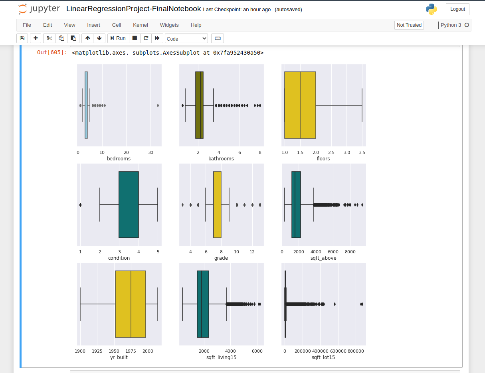
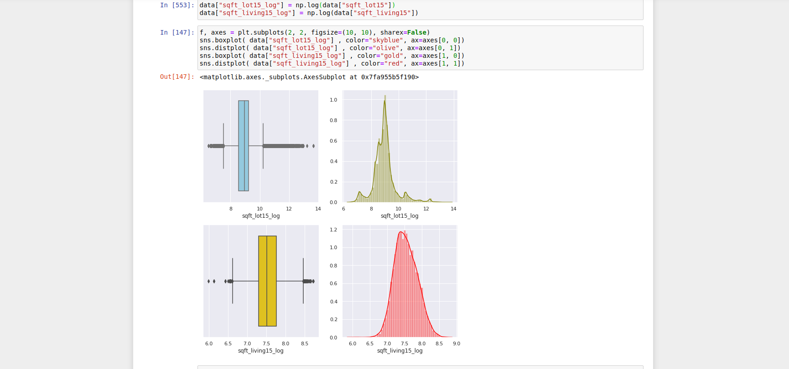

# Housing Price Analysis Project
### Andrew Ashdown - November 2020

## Project

Using historical data from property sales in Washington state, USA, I was asked to analyse and provide insight, as well as complete a number of specific tasks in SQL, Tableau and use Python to build a machine learning model to predict the selling prices of houses based on a variety of features on which the value of the house is evaluated.

## My Approach

I initially approached the project by brainstorming and creating a Kanban board, listing all of the jobs that I thought needed to completed in order to fulfil all the requirements, however was very aware that I would probably encounter a number of problems along the way therefore wanted to follow Agile methodology to allow for flexibility and continuous improvement.

Project Deliverables

  *  A slides deck: [My Slides](https://docs.google.com/presentation/d/1aU0oN8-odVbOynBnhMiN4cmolKOtC3c3SeO_X2kwP5M/edit?usp=sharing)
  *  A presentation: *Recorded Live*
  * SQL Queries: [My SQL Soultions](https://github.com/surelybassy/RegressionAnalysisProject/blob/master/SQL%20Queries/SQL%20Tasks%20and%20Solutions.md)
  * A Tableau Dashboard: [My Dashboard is Here](https://public.tableau.com/profile/andrew.ashdown#!/vizhome/MidBootcampProject-Story/AA-Mid-BootcampDashboard
)
  * Python code: [My Jupyter Notebook](https://github.com/surelybassy/RegressionAnalysisProject/blob/master/JupyterNotebooks/LinearRegressionProject-FinalNotebook.ipynb)

## SQL

There were a number of tasks and questions to answer in SQL and I decided to start with these, as I was most comforatable using MySQL. For these tasks I used MySQL Workbench. After creating the database, I used the import wizard to import the CSV file and then began to explore the data. My solutions to this can be found in the SQL folder of this repository.

[My SQL Soultions](https://github.com/surelybassy/RegressionAnalysisProject/blob/master/SQL%20Queries/SQL%20Tasks%20and%20Solutions.md)

## The Data

 

After competing the SQL tasks, I moved into Python. I imported the data into a Pandas dataframe and began to explore and analyse the data by using a number of different graphs and plots from Seaborn. This helped to identify features in the dataset that would require special attention during  cleaning and preprocessing.

There were a number of duplicate property IDs for property sold twice within the time period. I decided to only include the most recent sale, as it would give a more accurate picture of the property market in the area at the time.

Using Box Plots, I could see that some of the data was very skewed and would need to think about how to deal with the outliers, specifically one property with 33 bedrooms. There were also several columns containing a significant number of 0 values. 

## Cleaning the Data

Using a correlation matrix, I was able to indicate which columns had little to no correlation to the price of the property. I dropped several columns and then categrorised several of the columns that had mostly 0 values. I found I was able to get a more Normal Distribution for some of the data by running it through a log function, which should help with building a model. I identified the columns that were numerical and categorical, so I could either scale, normalise or use dummy variables in my model.

## Modelling the Data

After cleaning the data, I used a number of different regression algorithms to try and model the data and reviewed the results of each. I was able to get a score of 0.56 from the Linear Regressor. I ran several iteration using different combinations of columns to see if I could improve the score. After refining the model I was able to increase the score of my model to 0.73 using the KNN regressor. After doing lots of research I experimented with the ensemble.GradientBoostingRegressor and created a model with a score of 0.84. I then explored the predictions from each model and found that the KNN regressor was on average 22% away from the actual sales value and the ensemble regressor was only 13% away.

## Tableau

I found Tableau was very useful for both exploring the data and providing insight. After completing the assigned task, I was able to identify lots of interesting information for further exploration. Particularly looking at property built during different periods in history and how current events might effect the future value of property. I created a number of different dashboards along with one final dashboard with the information I found most interesting. [These can all be found here](https://public.tableau.com/profile/andrew.ashdown#!/vizhome/MidBootcampProject-Story/AA-Mid-BootcampDashboard
)

## Review

Using SQL, Tableau and various technique in Python I was able to gain lots of insight into the property market of Washington state. There were certain things you would expect to see, such as property value being in corrolation to the size of the property. Using the mapping techniques in Tableau I was able to identify more affluent areas and see how location effects the price of properties. 

Using various modelling techniques I was able to create a model, that for properties with certain feature, was able to predict the sales value fairly accurately. I believe that with more refining I can improve my model to make better predictions.
