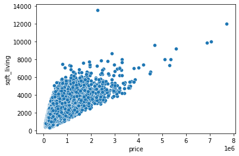
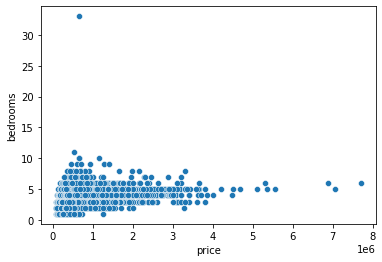
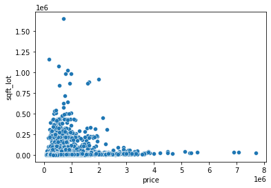
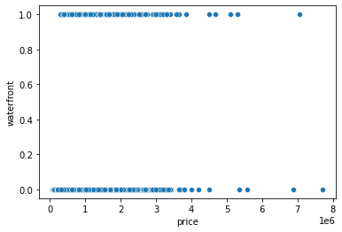
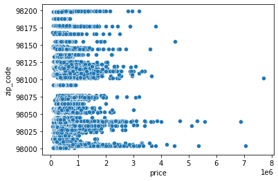
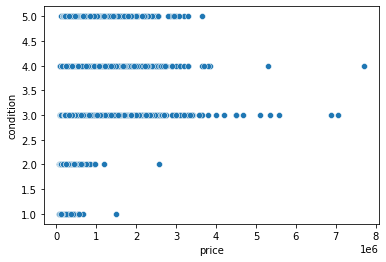
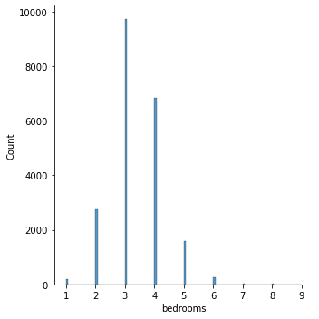
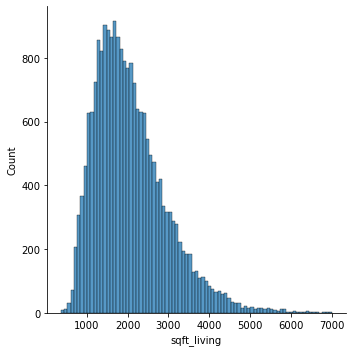
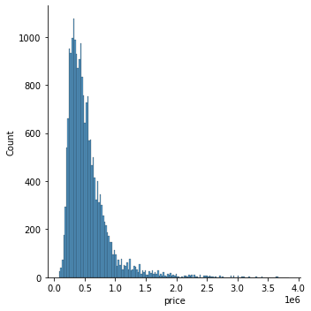
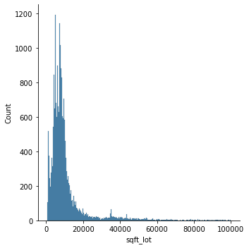

# Regression Analysis: Exploration and data cleaning and wrangling

### This notebook is to exlore, understand and briefly visualise the original dataset to better understand the project and preapares the data for analzsis and later modelling through cleaning and wrangling.

#### Jump to:
  
<a href='#exploring'>Exploring the Dataset </a>
  
<a href='#cleaning'>Data Cleaning and Wrangling </a>

  
  

## Getting started

### Start off by importing source of data and libraries


```python
#Import Libraries
import pandas as pd
import numpy as np
import matplotlib.pyplot as plt
import seaborn as sns
pd.set_option('display.max_columns', None)
```

### Import data from csv file


```python
data = pd.read_csv("regression_data.csv")
```


```python
#this file is here so the data is saved as a csv file which can be imported into Tableau
data.to_csv('regression_data_updated.csv')
```

### Making the data set usable by clarrifying the data clasification by labeling columns 


```python
data.columns = ['id','date', 'bedrooms', 'bathrooms','sqft_living', 'sqft_lot', 'floors', 'waterfront', 'view', 
                'condition', 'grade', 'sqft_above', 'sqft_basement', 'yr_built', 'yr_renov', 'zip_code', 'lat', 
                'long', 'sqft_living15', 'sqft_lot15', 'price']
data.head(10)
```


<div>
<style scoped>
    .dataframe tbody tr th:only-of-type {
        vertical-align: middle;
    }

    .dataframe tbody tr th {
        vertical-align: top;
    }

    .dataframe thead th {
        text-align: right;
    }
</style>
<table border="1" class="dataframe">
  <thead>
    <tr style="text-align: right;">
      <th></th>
      <th>id</th>
      <th>date</th>
      <th>bedrooms</th>
      <th>bathrooms</th>
      <th>sqft_living</th>
      <th>sqft_lot</th>
      <th>floors</th>
      <th>waterfront</th>
      <th>view</th>
      <th>condition</th>
      <th>grade</th>
      <th>sqft_above</th>
      <th>sqft_basement</th>
      <th>yr_built</th>
      <th>yr_renov</th>
      <th>zip_code</th>
      <th>lat</th>
      <th>long</th>
      <th>sqft_living15</th>
      <th>sqft_lot15</th>
      <th>price</th>
    </tr>
  </thead>
  <tbody>
    <tr>
      <th>0</th>
      <td>6414100192</td>
      <td>12/9/14</td>
      <td>3</td>
      <td>2.25</td>
      <td>2570</td>
      <td>7242</td>
      <td>2.0</td>
      <td>0</td>
      <td>0</td>
      <td>3</td>
      <td>7</td>
      <td>2170</td>
      <td>400</td>
      <td>1951</td>
      <td>1991</td>
      <td>98125</td>
      <td>47.7210</td>
      <td>-122.319</td>
      <td>1690</td>
      <td>7639</td>
      <td>538000</td>
    </tr>
    <tr>
      <th>1</th>
      <td>5631500400</td>
      <td>2/25/15</td>
      <td>2</td>
      <td>1.00</td>
      <td>770</td>
      <td>10000</td>
      <td>1.0</td>
      <td>0</td>
      <td>0</td>
      <td>3</td>
      <td>6</td>
      <td>770</td>
      <td>0</td>
      <td>1933</td>
      <td>0</td>
      <td>98028</td>
      <td>47.7379</td>
      <td>-122.233</td>
      <td>2720</td>
      <td>8062</td>
      <td>180000</td>
    </tr>
    <tr>
      <th>2</th>
      <td>2487200875</td>
      <td>12/9/14</td>
      <td>4</td>
      <td>3.00</td>
      <td>1960</td>
      <td>5000</td>
      <td>1.0</td>
      <td>0</td>
      <td>0</td>
      <td>5</td>
      <td>7</td>
      <td>1050</td>
      <td>910</td>
      <td>1965</td>
      <td>0</td>
      <td>98136</td>
      <td>47.5208</td>
      <td>-122.393</td>
      <td>1360</td>
      <td>5000</td>
      <td>604000</td>
    </tr>
    <tr>
      <th>3</th>
      <td>1954400510</td>
      <td>2/18/15</td>
      <td>3</td>
      <td>2.00</td>
      <td>1680</td>
      <td>8080</td>
      <td>1.0</td>
      <td>0</td>
      <td>0</td>
      <td>3</td>
      <td>8</td>
      <td>1680</td>
      <td>0</td>
      <td>1987</td>
      <td>0</td>
      <td>98074</td>
      <td>47.6168</td>
      <td>-122.045</td>
      <td>1800</td>
      <td>7503</td>
      <td>510000</td>
    </tr>
    <tr>
      <th>4</th>
      <td>7237550310</td>
      <td>5/12/14</td>
      <td>4</td>
      <td>4.50</td>
      <td>5420</td>
      <td>101930</td>
      <td>1.0</td>
      <td>0</td>
      <td>0</td>
      <td>3</td>
      <td>11</td>
      <td>3890</td>
      <td>1530</td>
      <td>2001</td>
      <td>0</td>
      <td>98053</td>
      <td>47.6561</td>
      <td>-122.005</td>
      <td>4760</td>
      <td>101930</td>
      <td>1230000</td>
    </tr>
    <tr>
      <th>5</th>
      <td>1321400060</td>
      <td>6/27/14</td>
      <td>3</td>
      <td>2.25</td>
      <td>1715</td>
      <td>6819</td>
      <td>2.0</td>
      <td>0</td>
      <td>0</td>
      <td>3</td>
      <td>7</td>
      <td>1715</td>
      <td>0</td>
      <td>1995</td>
      <td>0</td>
      <td>98003</td>
      <td>47.3097</td>
      <td>-122.327</td>
      <td>2238</td>
      <td>6819</td>
      <td>257500</td>
    </tr>
    <tr>
      <th>6</th>
      <td>2008000270</td>
      <td>1/15/15</td>
      <td>3</td>
      <td>1.50</td>
      <td>1060</td>
      <td>9711</td>
      <td>1.0</td>
      <td>0</td>
      <td>0</td>
      <td>3</td>
      <td>7</td>
      <td>1060</td>
      <td>0</td>
      <td>1963</td>
      <td>0</td>
      <td>98198</td>
      <td>47.4095</td>
      <td>-122.315</td>
      <td>1650</td>
      <td>9711</td>
      <td>291850</td>
    </tr>
    <tr>
      <th>7</th>
      <td>2414600126</td>
      <td>4/15/15</td>
      <td>3</td>
      <td>1.00</td>
      <td>1780</td>
      <td>7470</td>
      <td>1.0</td>
      <td>0</td>
      <td>0</td>
      <td>3</td>
      <td>7</td>
      <td>1050</td>
      <td>730</td>
      <td>1960</td>
      <td>0</td>
      <td>98146</td>
      <td>47.5123</td>
      <td>-122.337</td>
      <td>1780</td>
      <td>8113</td>
      <td>229500</td>
    </tr>
    <tr>
      <th>8</th>
      <td>3793500160</td>
      <td>3/12/15</td>
      <td>3</td>
      <td>2.50</td>
      <td>1890</td>
      <td>6560</td>
      <td>2.0</td>
      <td>0</td>
      <td>0</td>
      <td>3</td>
      <td>7</td>
      <td>1890</td>
      <td>0</td>
      <td>2003</td>
      <td>0</td>
      <td>98038</td>
      <td>47.3684</td>
      <td>-122.031</td>
      <td>2390</td>
      <td>7570</td>
      <td>323000</td>
    </tr>
    <tr>
      <th>9</th>
      <td>1736800520</td>
      <td>4/3/15</td>
      <td>3</td>
      <td>2.50</td>
      <td>3560</td>
      <td>9796</td>
      <td>1.0</td>
      <td>0</td>
      <td>0</td>
      <td>3</td>
      <td>8</td>
      <td>1860</td>
      <td>1700</td>
      <td>1965</td>
      <td>0</td>
      <td>98007</td>
      <td>47.6007</td>
      <td>-122.145</td>
      <td>2210</td>
      <td>8925</td>
      <td>662500</td>
    </tr>
  </tbody>
</table>
</div>


## <a id='exploring'>Exploring the Dataset </a>


```python
#  data shape as a variable so we can compare it with cleanup 
dataShape = data.shape
dataShape
```


    (21596, 21)


```python
data.info()
```

    <class 'pandas.core.frame.DataFrame'>
    RangeIndex: 21596 entries, 0 to 21595
    Data columns (total 21 columns):
     #   Column         Non-Null Count  Dtype  
    ---  ------         --------------  -----  
     0   id             21596 non-null  int64  
     1   date           21596 non-null  object 
     2   bedrooms       21596 non-null  int64  
     3   bathrooms      21596 non-null  float64
     4   sqft_living    21596 non-null  int64  
     5   sqft_lot       21596 non-null  int64  
     6   floors         21596 non-null  float64
     7   waterfront     21596 non-null  int64  
     8   view           21596 non-null  int64  
     9   condition      21596 non-null  int64  
     10  grade          21596 non-null  int64  
     11  sqft_above     21596 non-null  int64  
     12  sqft_basement  21596 non-null  int64  
     13  yr_built       21596 non-null  int64  
     14  yr_renov       21596 non-null  int64  
     15  zip_code       21596 non-null  int64  
     16  lat            21596 non-null  float64
     17  long           21596 non-null  float64
     18  sqft_living15  21596 non-null  int64  
     19  sqft_lot15     21596 non-null  int64  
     20  price          21596 non-null  int64  
    dtypes: float64(4), int64(16), object(1)
    memory usage: 3.5+ MB


```python
# Check if IDs are unique
data["id"].nunique
```


    <bound method IndexOpsMixin.nunique of 0        6414100192
    1        5631500400
    2        2487200875
    3        1954400510
    4        7237550310
                ...    
    21591     263000018
    21592    6600060120
    21593    1523300141
    21594     291310100
    21595    1523300157
    Name: id, Length: 21596, dtype: int64>


```python
data.isna().sum() #no NaN values
```


    id               0
    date             0
    bedrooms         0
    bathrooms        0
    sqft_living      0
    sqft_lot         0
    floors           0
    waterfront       0
    view             0
    condition        0
    grade            0
    sqft_above       0
    sqft_basement    0
    yr_built         0
    yr_renov         0
    zip_code         0
    lat              0
    long             0
    sqft_living15    0
    sqft_lot15       0
    price            0
    dtype: int64


### Exploring the values of individual columns


```python
data['bedrooms'].value_counts()
```


    3     9823
    4     6882
    2     2760
    5     1601
    6      272
    1      196
    7       38
    8       13
    9        6
    10       3
    11       1
    33       1
    Name: bedrooms, dtype: int64


```python
data['waterfront'].value_counts()
```


    0    21433
    1      163
    Name: waterfront, dtype: int64


```python
data['view'].value_counts()
```


    0    19474
    2      961
    3      510
    1      332
    4      319
    Name: view, dtype: int64


```python
data['condition'].value_counts() # Condition 1 indicates poor and 5 excellent.
```


    3    14019
    4     5677
    5     1701
    2      170
    1       29
    Name: condition, dtype: int64


```python
data['grade'].value_counts()
```


    7     8973
    8     6065
    9     2615
    6     2038
    10    1134
    11     399
    5      242
    12      89
    4       27
    13      13
    3        1
    Name: grade, dtype: int64


```python
data['yr_built'].value_counts()
```


    2014    559
    2006    453
    2005    450
    2004    433
    2003    420
           ... 
    1933     30
    1901     29
    1902     27
    1935     24
    1934     21
    Name: yr_built, Length: 116, dtype: int64


```python
data['price'].head(10)
```


    0     538000
    1     180000
    2     604000
    3     510000
    4    1230000
    5     257500
    6     291850
    7     229500
    8     323000
    9     662500
    Name: price, dtype: int64


### Using scatter plots to visualise the data to identify outlying data and patterns


```python
sns.scatterplot(data=data, x='price', y='sqft_living')
```


    <AxesSubplot:xlabel='price', ylabel='sqft_living'>


    

    


```python
sns.scatterplot(data=data, x='price', y='bedrooms')
```


    <AxesSubplot:xlabel='price', ylabel='bedrooms'>


    

    


```python
sns.scatterplot(data=data, x='price', y='sqft_lot')
```


    <AxesSubplot:xlabel='price', ylabel='sqft_lot'>


    

    


```python
sns.scatterplot(data=data, x='price', y='waterfront')
```


    <AxesSubplot:xlabel='price', ylabel='waterfront'>


    

    


```python
sns.scatterplot(data=data, x='price', y='zip_code')
```


    <AxesSubplot:xlabel='price', ylabel='zip_code'>


    

    


```python
sns.scatterplot(data=data, x='price', y='condition')
```


    <AxesSubplot:xlabel='price', ylabel='condition'>


    

    


## <a id='cleaning'>Data Cleaning and Wrangling </a>

## IDs must be unique to avoid data duplication


```python
# Check for ID uniquness
data["id"].value_counts()
```


    795000620     3
    1825069031    2
    7977201065    2
    251300110     2
    3969300030    2
                 ..
    7812801125    1
    4364700875    1
    3021059276    1
    880000205     1
    1777500160    1
    Name: id, Length: 21419, dtype: int64


### Cleaning duplicated rows


```python
data = data.drop_duplicates(['id'], keep='last')
```

### Validating the  ID Cleanup


```python
# Check for ID uniquness
data["id"].value_counts()
```


    2911700010    1
    5450300010    1
    5104511600    1
    1160000115    1
    686530110     1
                 ..
    2115510470    1
    2922701305    1
    6071600370    1
    526059224     1
    1777500160    1
    Name: id, Length: 21419, dtype: int64


```python
# Compare original data with new values
dataShapeClean1 = data.shape
print(dataShape, dataShapeClean1, sep="\n")
```

    (21596, 21)
    (21419, 21)


### Dealing with Outliers


```python
# The bedroom column has several outliers where properties have more than nine bedrooms. 
data = data[data['bedrooms']<=9]
sns.displot(data['bedrooms']) # Now it has a slightly better distribution.

```


    <seaborn.axisgrid.FacetGrid at 0x7f995d0ad280>


    

    


```python
# The sqft_living column has several outliers where properties have more than 7000 sq ft of living space. 
data = data[data['sqft_living']<=7000]
sns.displot(data['sqft_living']) # Now it has a slightly better distribution.
```


    <seaborn.axisgrid.FacetGrid at 0x7f995d000f10>


    

    


```python
# The price column has several outliers where properties values are in excess of 4000000 dollars
data = data[data['price']<=4000000]
sns.displot(data['price']) # Now it has a slightly better distribution.
```


    <seaborn.axisgrid.FacetGrid at 0x7f9959b4efa0>


    

    


```python
# The lot column has several outliers where lot size are in excess of 100000 sq ft
data = data[data['sqft_lot']<=100000]
sns.displot(data['sqft_lot']) # Now it has a slightly better distribution.
```


    <seaborn.axisgrid.FacetGrid at 0x7f995e035bb0>


    

    


### Data explored, cleaned and wrangled!
