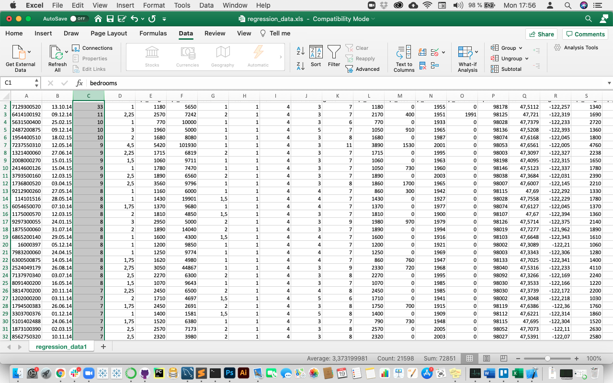
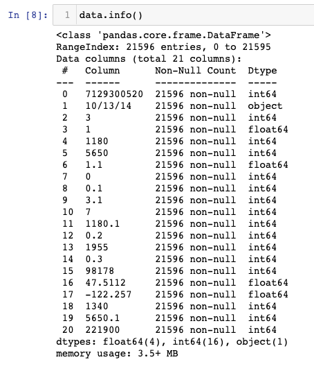
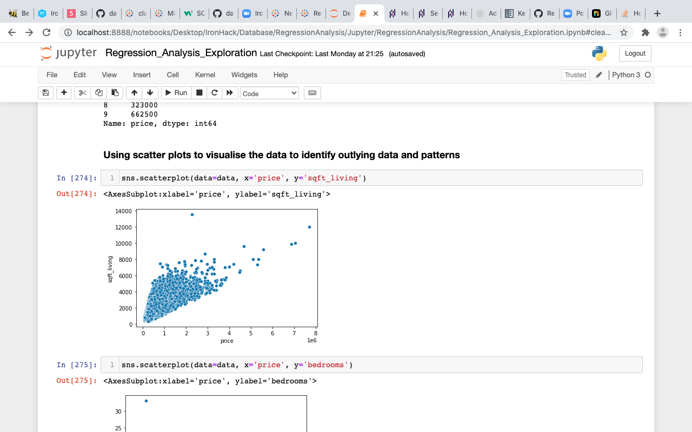
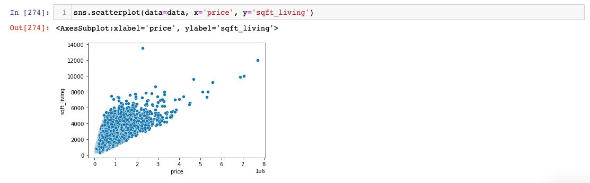
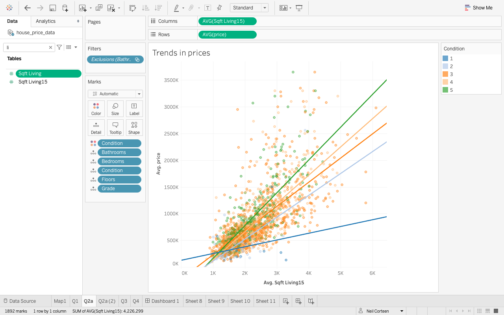
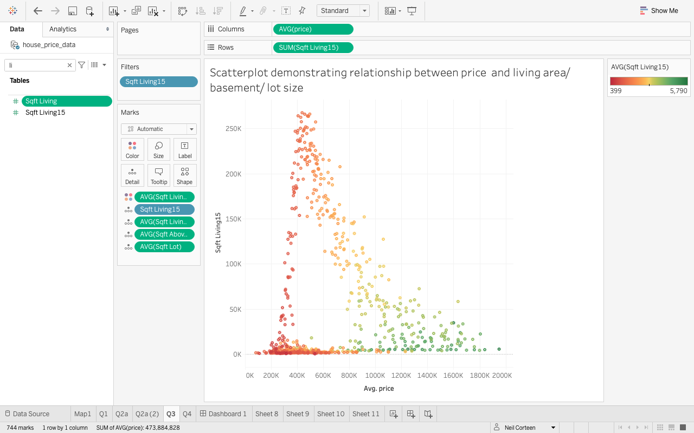
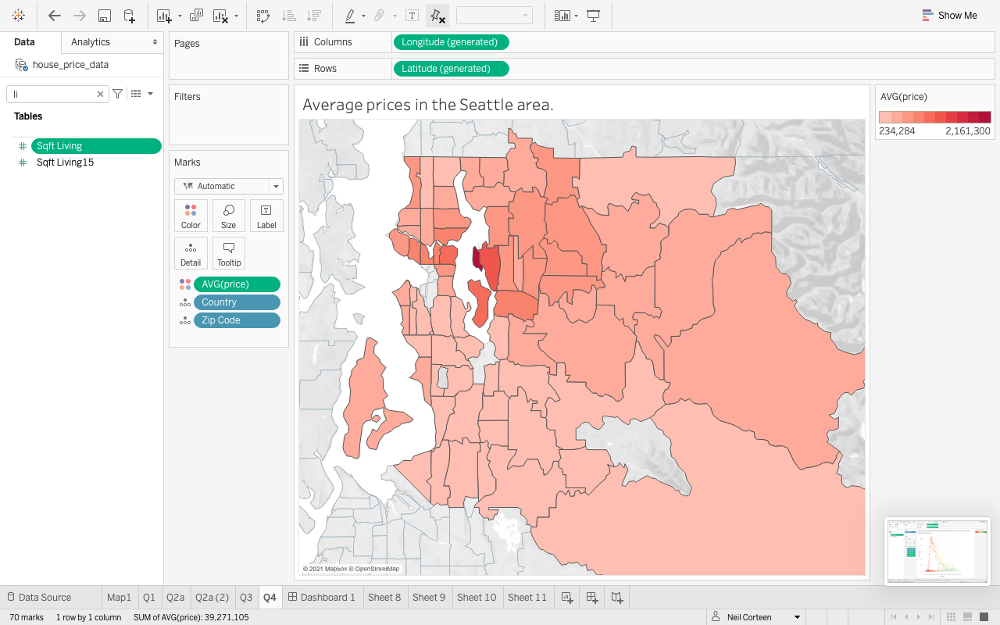
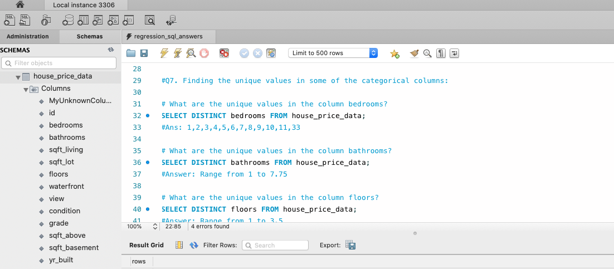

# Regression Analysis: Predicting house price values.

_Neil Corteen, April 2021_

## Aim

The aim of the project was to combine and use the skills learnt in the first four weeks of a data analyst bootcamp and encompassed three main tools, MySQL, Python /Jupyter and  Tableau.

## Quick reference:
There were five clear deliverables:

- SQL querie Solution [here](./SQL/SQL_Solution.md)
- A Tableau Dashboard [here](./Tableau/Dashboard_Image.png)
- Python code [here](./Jupyter/Documents/Regression_Analysis_Exploration.md)
- A short public presentation (5-7 mins)
- using the assistance of a visual presentation

The original csv file can be viewed [here](./OriginalData/regression_data.csv).
The updated csv file can be viewed [here](./UpdatedData/house_price_data.csv).

## Scenario

The scenario was to take the role of a real estate analyst and build a model that could predict the price of a house based on features provided in the dataset and to gain a better understanding of factors that impact property values.

## Understanding the project.

My first start was to read through the brief, then start to gather ideas and breakdown the individual elements to be completed. I applied the agile project management method with the aid of Trello which is a collaborative tool that organises projects into tasks. This aided the thought process, provided a space to access resources, organize ides as well as optimising tasks.
 
To get a feel for the data I initially viewed it on Excel, using sorting functions to view extremes in the data. 

The data set was from the Seattle area of the USA, encompasing data on almost 22,000 properties that were sold between 2014 and 2015. Initial findings were that the data was fairly clean with no obvious missing values, but included several columns that only represented some of the data, thus with many zeros. Some were for obvious reasons, such as if a property had a view or waterfront location, others were more ambiguous, such as year renovated. There were also location specific references such as grade 4-13, condition 1-5 and view 0 -4 to be considered and understood. These were clarified in the brief as:

•    **Id**: Unique identification number for the property.
•    **date**: date the house wassold.
•   **price**: price of the house.
•   **waterfront**: house which has a view to a waterfront.
•   **condition**: How good the condition is (overall). 1 indicates worn out property and 5excellent.
•   **grade**: Overall grade given to the housing unit, based on King County grading system. 1 poor ,13 excellent.
•   **Sqft_above**: square footage of house apart from basement.
•   **Sqft_living15**: Living room area in 2015 (implies - some renovations). This might or might not have affected the lotsize area.
•   **Sqft_lot15**: lotSize area in 2015 (implies - some renovations).

This simple process began to show potential questions and ways to organize the data, such as:
How does condition impact on value?
Does waterfront location affect value?
Condition: 5= excellent 1= poor Create bins?
Sqft below: 8487 properties have basements. Does having a basement impact on value?
Grade:  4-13 And how does grade impact on value?
Year built: 37 built in 2015, 561 built in 2014, oldest built in 1900. Create bins in decades? Does new build or  ‘heritage’ property eg before 1940 affect value?
Yr renovated: just 914 properties have renovation dates, ranging from 1934 to 2015, will this be representative? and are properties renovated in the last ten years impact on value?

And a clear idea of the range of data:
Sqft lot: from 651 to 871200
960 larger than 40000 sqft
68 less than 1000 sqft
Outliers, 2 = ca 85000 sqft

## Python using Jupyter Notebook
Following this I used Jupyter Notebook to script code in Python. I imported the csv dataset into a Panda framework. This visual method proved to be faster than scoping in Excel and showed some obvious correlations, outliers and it was possible to retrieve more detailed information and data types. The first task was to categorise the columns to better understand the date. Then I ran functions to scope the data:

Then I began to visualise it using matplotlib and seaborn functions: 

Once the scoping was completed I used this information to focus on the data cleaning and wrangling processes, such as removing duplicated Ids, using judgement to remove outliers. I completed this process so far so I could use the information for further analysis and visualization in Tableau. 

Further processing may be needed before modelling, such as dealing with columns with many zeros and considering columns removing columns that do not add value.

## Tableau
The cleaned data was converted into csv and uploaded into Tableau. This provided a great oportunity to explore and present various combitations of data:  

## SQL
The SQL element comprised of tasks and specific questions to practice retrieving information from databases. To perform the task I imported the given csv file into MySQL Workbench. The questions and answers can be viewed [here](./SQL/SQL_Solution.md).

